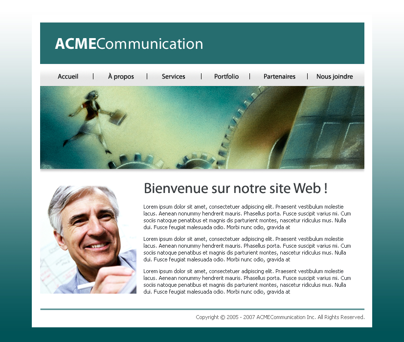

# acme

Simple stuff. The basics of HTML and CSS. First semester of school.

I say simple now but it was actually daunting at first.  Had to work from the
`.psd` and `.jpg` files provided and hand-code the `HTML` and `CSS` to make it
look as close as possible.

I think I did a pretty good job for a first assignment  :)

Result can be viewed <a target="_blank" href="http://bengudro.insomnia247.nl/code/acme/">here</a>.

